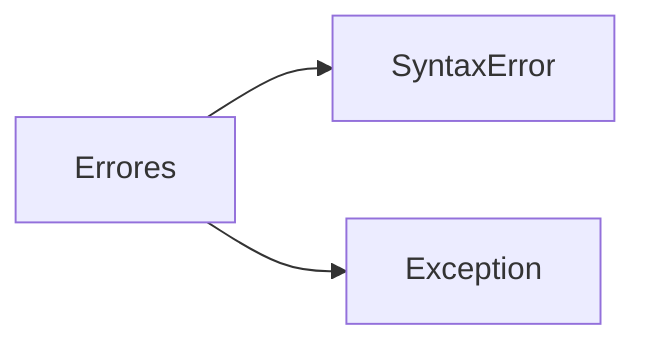
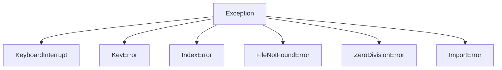
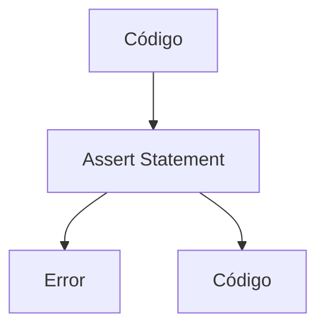
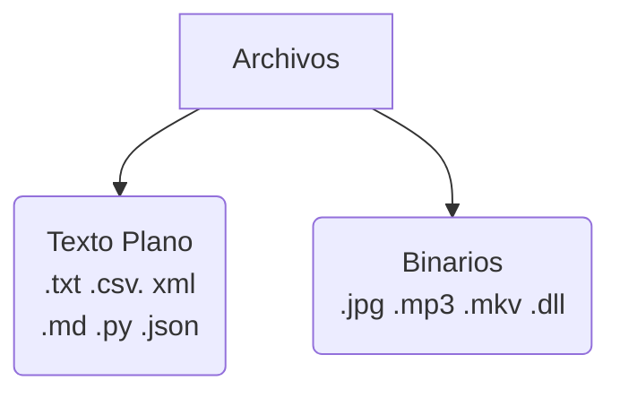

# Curso de python: comprehensions, lambdas y manejo de errores

[TOC]

## El zen de python🙏

Importando el módulo `this`, se puede mostrar el zen (los principios más importantes de python). Se creó en 1999 por Tim Peters. El zen es:

1. Beautiful is better than ugly.
2. Explicit is better than implicit.
3. Simple is better than complex.
4. Complex is better than complicated.
5. Flat is better than nested.
6. Sparse is better than dense.
7. Readability counts.
8. Special cases aren't special enough to break the rules.
9. Although practicality beats purity.
10. Errors should never pass silently.
11. Unless explicitly silenced.
12. In the face of ambiguity, refuse the temptation to guess.
13. There should be one -and preferably only one- obvious way to do it.
14. Although that way may not be obvious at first unless you're Dutch.
15. Now is better than never.
16. Although _never_ is often better than _right_ now.
17. If the implementation is hard to explain, it's a bad idea.
18. If the implementation is easy to explain, it may be a good idea.
19. Namespaces are one honking great idea -- let's do more of those!

## Entornos virtuales 💻

Es como *clonar* la instalación de python para cada proyecto que tengamos. De esta manera, podemos instalar, actualizar o remover versiones de python y de sus módulos sin afectar la dependencia de otros proyectos.

``` bash
# En python, <-m> se usa para llamar a un módulo
# Por convención se llama <venv> al ambiente virtual
python3 -m venv <nombre_del_ambiente>

# Para activar el ambiente
source <nombre_del_ambiente>/bin/activate

# Para desactivar el ambiente
deactivate
```

Por supuesto, se puede definir un *alias* para no tener que escribir todo el comando de activación/desactivación cada vez.

> 💡 El ambiente virtual sólo funciona en nuestra computadora, por lo que debería ignorarse si se sube el proyecto a GitHub con un `.gitignore`.

### PIP 🐍

Con pip podemos instalar módulos de forma global o individualmente para cada ambiente virtual. También podemos exportar a un archivo los módulos instalados para que otra persona sepa y después pueda instalar los módulos necesarios para el proyecto ¡incluso si esta al otro lado del mundo!

```python
# Listemos los paquetes que tenemos instalados y exportémoslos a un archivo
pip freeze > requirements.txt

# Para instalar los archivos especificados del archivo
pip install -r requirements.txt
```

## Comprehension lists & dicts 📖

Primero debemos recordar que , como las listas, tuplas y diccionarios son todos objetos de python, pueden anidarse y usarse unos dentro de otros:

```python
# Diccionarios en listas
pepes_nerd = [
    {"number": "1", "name":"Guty"},
    {"number": "2", "name":"Armando"},
    {"number": "3", "name":"Marco"},
    {"number": "4", "name":"Shake"},
    {"number": "5", "name":"Pol"},
    {"number": "6", "name":"Jorge"},
    {"number": "7", "name":"Bean"},
    {"number": "8", "name":"Edgar"},
    {"number": "9", "name":"Mooze"},
    {"number": "10", "name":"MMM"},
    {"number": "11", "name":"Brendita"},
    {"number": "12", "name":"Lisset"},
]

# Listas en diccionarios
number_families = {
    "natural": [0, 1, 2, 3, 4, 5],
    "integer": [-2, -1, 0 , 1, 2],
    "real": [-4.5, -2.53, 2.718, 3.14]
}
```

Las *comprehension lists* son estructuras que se usan para crear nuevas listas y siguen la sintaxis `[element for element in iterable if condition]`  y se lee primero el ciclo, luego el elemento y luego la condición: *para cada **elemento** del **iterable** guarda el **elemento** sólo si se cumple la siguiente **condición***.

Por ejemplo, si queremos obtener el cuadrado de los números del 1 al 100 que **NO** sean divisibles entre 3 podemos resolver el problema de dos formas:

```python
# Método 1: clásico
squares =[]
for i in range(1, 101):
    if (i%3 != 0):
        squares.append(i**2)
        
# Método 2: comprehension list
squares = [i**2 for i in range(1, 101) if (i%3 != 0)]
```

Y podemos hacer ejemplos más complejos, como crear una lista de todos los múltiplos de 4, 6 y 9 menores a 5 dígitos:

```python
overly_complicated_list = [i for i in range(1, 99999) if (i%4 == 0 and i%6 == 0 and i%9 == 0)]
```

Un concepto similar se aplica a los diccionarios, con la sintaxis `{key: value for value in iterable if condition}`. De igual manera, la lectura es *para cada **elemento** del **iterable**, guarda ese **elemento** como la llave y valor sólo si se cumple la **condición***. Por ejemplo, para crear un diccionario tal que:

- sus llaves sean no divisibles entre 3 de entre los primeros 100 números naturales y
- sus valores sean el valor de la llave al cubo

```python
comp_dict = {i: i**3 for i in range(1, 101) if i%3 != 0}
```

## Funciones 🔧

### Funciones anónimas 🕵️‍♂️

También se conocen como funciones lambda y son funciones de una sóla linea con la sintaxis `<identificador> = lambda <argumentos>: <expresión>`. El objeto función se almacena en el identificador y así es como podemos invocarla:

```python
# Para checar si una palabra es un palíndromo
p_check = lambda word: word == word[::-2]

p_check("ana") # True
```

Un ejemplo peculiar de las funciones anónimas es al hacer la *fusión* de diccionarios. Para cada *entrada de diccionario* `worker`, añade una *llave* llamada `old` cuyo *valor* sea la evaluación (`True` o `False`) de si su edad es mayor a 70 años:

```python
lambda worker: worker | {"old": worker["age"] >= 70}
```

> 💡 El operador "`|`" es el *pipe operator* y es nuevo de python 3.9. Es el equivalente a sumar listas, pero con diccionarios.

Por supuesto, el código anterior es mucho más útil si lo aplicamos con (spoiler 👀) [la función map](#`map`).

### Funciones de orden superior

Una función es de orden superior cuyo argumento incluye otra función, por ejemplo:

```python
# Función de orden superior
def run(func):
    func()

# Función común, genérica y corriente
def holi():
    print("Holi! 😃")
    
# Función común, genérica y corriente 2
def bye():
    print("Adiós 🙁")
    
run(holi)	# "Holi! 😃"
run(bye)	# "Adiós 🙁"
```

Las tres funciones de orden superior más importantes son:

#### `filter`

Sirve para aplicar una función (primer argumento) como criterio a un iterable (segundo argumento) cualquier cosa que pueda recorrerse en python). Por ejemplo, podemos *filtrar* los elementos impares:

```python
my_list = [1,2,4,5,6,8,9,11]
odd_only = list(filter(lambda x: x%2 != 0, my_list))
print(odd) # [1,5,9,11]
```

#### `map`

Nos permite aplicar una función a cada elemento de un iterable con la misma sintaxis que con `filter`, usando una función en el primer argumento y el iterable en el segundo uwu. Por ejemplo, podemos elevar al cuadrado *cada* elemento de `my_list`:

```python
my_list = [1, 2, 3, 4, 5]
squared = list(map(lambda x: x**2, my_list))
print(squared) # [1, 4, 9, 16, 25]
```

#### `reduce`

Esta función *colapsa* o *reduce* todos los elementos a un único resultado aplicando una función con **dos** argumentos: el primero de ellos actuará como el *resultado acumulado final* y, el segundo, será el siguiente elemento del iterable.

> 💡 ¡La función `reduce` debe importarse del módulo `functools`!

Por ejemplo, podemos *reducir* `[2, 2, 2, 2]` a 16 mediante:

```python
from functools import reduce
my_list = [1, 2, 3, 4, 5, 6]
product = reduce(lambda a,b: a*b, my_list)
print(product) # 720
```


## Manejo de errores 💀

### Cuando python **no** nos avisa que cometimos un error 😥

Cuando python **no** nos avisa del error, lo más seguro es que tengamos un error de lógica en nuestro algoritmo, por lo que se recurre al *debugging* para *depurar* el programa. Muchos editores de texto e IDEs tienen herramientas incluidas para *depurar*, como pausar el código, avanzar línea por línea, *entrar* a una función, revisar los valores instantáneos de las variables y más 😃

### Cuando python nos avisa que tenemos un error 😃

Cuando python nos avisa del error lo hace a través de un *traceback*. Esto puede ser culpa ya sea de un `SyntaxError` o de un `Exception`.



#### `SyntaxError`

Un `SyntaxError` es de los errores más comunes y se refiere a un error de escritura o *typo*. Por ejemplo, escribir "`far`" en vez de "`for`" o "`lamda`" en vez de "`lambda`". Cuando tenemos un `SyntaxError` el programa **no** se ejecuta en absoluto, ya que el motor de python analiza todas las líneas de código a priori.

#### `Exceptions`

Las excepciones ocurren cuando, a pesar de estar perfectamente escrita, una expresión se encuentra con un error de algún tipo al *intentar* ejecutarse. Por ello, cuando ocurre una excepción, el código se ejecuta normalmente hasta que ocurra una de ellas en alguna línea específica.

Algunas de las excepciones más comunes son:



- `KeyboardInterrupt`:
  Al presionar `Ctrl + C` en la terminal para terminar el proceso, python *eleva* esta excepción para cancelar todo.

- `KeyError`:
  Al tratar de acceder a una llave de un diccionario que no existe (la llave, no el diccionario).

- `IndexError`:
  Cuando se intenta acceder al índice de un iterable fuera de rango (como `x[4]` cuando `x = [0, 1]`.

- `FileNotFoundError `:
  Al tratar de manipular un archivo que no existe.

- `ZeroDivisionError`:
  Al tratar de dividir entre 0 (y el universo explota 💥🌌)

- `ImportError`:
  Al salir mal la importación de un módulo.

Y muchas otras...

>  💡 ¡Hay más de 50 [excepciones incluidas](https://docs.python.org/3/library/exceptions.html#bltin-exceptions) en python!

La forma en la que python nos da detalles del error es mediante un *traceback* como el siguiente:

```python
# Te lo advertí 💥🌌
1/0

"""
Traceback (most recent call last):
  File "<stdin>", line 1, in <module>
ZeroDivisionError: division by zero
"""
```

1. Este *traceback* nos dice qué excepción ocurrió (`ZerDivisionError`) y un breve resumen de qué significa (division by zero).
2. Se nos indica en qué archivo ocurrió el error (`stdin` significa que fue mediante la consola), en qué línea y en qué módulo.
3. Y finalmente se nos da dónde ocurre la *traza del error*. Cuando ocurre una excepción que no se maneja, python la *eleva* a la siguiente función. Si en esa función "superior" tampoco se maneja, se vuelve a *elevar* a la función contenedora y así, sucesivamente, hasta llegar a la función principal. Si en esa función principal (que puede ser `run()` o `main()`, etc.) no se maneja, el programa se corta y se muestra el *traceback*.

>  💡 Un *traceback* se lee de abajo hacia arriba.

Para el manejo de excepciones incluidas en python usamos `try` y `except`. Por ejemplo, para un detector de palíndromos sólo deberíamos aceptar cadenas de caracteres. Si un usuario ingresara un número, obtendríamos un `TypeError`. Para alertar al usuario de buena manera (sin asustarlo con un *traceback* que puede que no entienda) usamos la sintaxis siguiente:

```python
def check_if_palindrome(message):
  return message == message[::-1]


try:
    print(check_if_palindrome(my_string))
except TypeError:
    print("Debes ingresar una palabra o mensaje")
```

Pero, si imaginamos un caso en el que el usuario ingrese una cadena vacía (`""`), python devolverá un `True` a pesar de que, intuitivamente, nosotros reconozcamos que es un error. En casos como este, usamos `raise` para generar un error **con nuestro propio mensaje** para el error:

```python
def check_if_palindrome(message):
	try:
		if len(message) == 0:
			raise ValueError("No se admiten cadenas vacías")
		return message == message[::-1]
    except ValueError as ve:
        print(ve)
        return False


try:
    print(check_if_palindrome(my_string))
except TypeError:
    print("Debes ingresar una palabra o mensaje")
```

En este código, guardamos el mensaje del `ValueError` en `ve` (que viene de *value error*). Se leería algo como "Intenta ... excepto que ocurra un error al que llamamos `ve`; de ser así, ejecuta ...". 

También podemos añadir un bloque `else` que se ejecuta **si y sólo si** no hubo ningún error dentro del bloque `try`. Finalmente, se usa `finally` (Ba Dum Tss 🥁) para cerrar archivos, cerrar conexiones a bases de datos o liberar recursos después de los bloques `try ... except`.

> 💡 El bloque `finally` se ejecuta **pase o no pase** un error.

Una estructura más completa, entonces se vería algo así:

```python
try:
	if (condición):
		raise <Exception>("Hiciste algo que técnicamente es legal pero no 😑")
	except <Exception>:
		print("Hiciste algo mal 😠")
	else:
		print("Aquí no pasó nada 😶")
	finally:
		print("Esto tengo que hacerlo de cualquier forma ¯\_(ツ)_/¯")
```

### Assert Statements 🧐

Las *afirmaciones* en python son una alternativa al manejo de errores con `try... except`. Se leen como "afirmo que *condición* y, si no, mandaré este *mensaje de error*" y se presentan de la forma:

```python
assert condición, "mensaje de error"
```



De esta forma, podemos manejar errores *en una sola línea de código*:

```python
def palindrome(string):
    assert len(string) > 0 , "No se admiten cadenas vacías"
    return string == string[::-1]

print(palindrome("")) # AssertionError: No se admiten cadenas vacías
```

> 💡 Al usarse `assert` se muestra **todo** el *traceback* del error.

¿Cuándo usar `assert` y cuándo usar `try ... except`? En realidad no hay una regla sólida. Se pueden intercambiar, aunque los bloques `try ... except` son mucho más comunes y los `assert` están más orientados a testeo y errores *del y para* el programador, tal como argumenta Al Sweigart:

> In plain English, an assert statement says “*I assert that this condition holds true, and if not, there is a bug somewhere in the program*.” Unlike exceptions, your code should not handle assert statements with try and except; if an assert fails, your program should crash. By failing fast like this, you shorten the time between the original cause of the bug and when you first notice the bug. This will reduce the amount of code you will have to check before finding the code that’s causing the bug. Assertions are for programmer errors, not user errors. For errors that can be recovered from (such as a file not being found or the user enter-ing invalid data), raise an exception instead of detecting it with an assertstatement.
>
> "How to automate the boring stuff with Python" - Al Sweigart

## Manejo de archivos 📄

A grosso modo tenemos dos tipos de archivos:



Normalmente en python **no** nos metemos con archivos binarios, pero sí con los de texto plano. Hay 3 modos en los que se puede abrir un archivo:

- R: lectura
- W: escritura (sobrescribiendo)
- A: escritura (de añadir, no sobrescribir)

Para abrir un archivo en python (ya sea en modo `"r"`, `"w"` o `"a"`) y guardarlo en una variable `file_name`, usamos:

```python
with open("ruta", "r") as file_name:
```

La palabra clave `with` es un *manejador contextual*; lo que hace es que, si se cierra de forma inesperada nuestro programa, el archivo no se rompe.

> 💡 Usar `encoding="utf-8"` como 3° argumento en `open` ayuda para tener mejor compatibilidad con caracteres extraños.